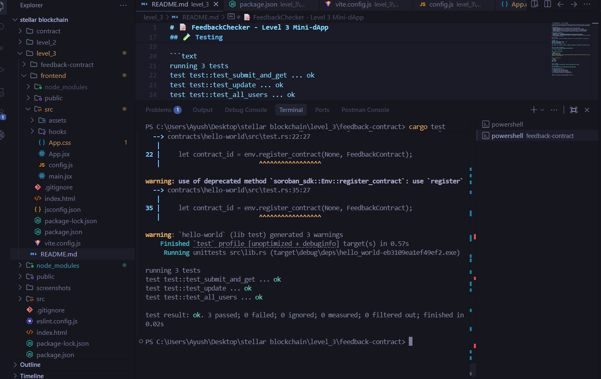

# 📝 FeedbackChecker - Level 3 Mini-dApp

A complete end-to-end decentralized feedback system built on the Stellar network. This project focuses on high-quality implementation, comprehensive testing, and professional documentation.

## 🚀 Features
- **Submit Feedback**: Securely record your message on the blockchain.
- **Address-based Search**: Check feedback left by any specific Stellar address.
- **Global Contributor List**: See everyone who has participated in the feedback loop.
- **Caching Layer**: Basic in-memory caching to reduce RPC calls for searched addresses.
- **Visual Feedback**: Real-time progress indicators and transaction status tracking.

## 📄 Contract Information
- **Network**: Stellar Testnet
- **Contract ID**: [`CCH6DFCGNAXEB32NZMQRWPB6IPJYQWY6FP6ZEDPEPLOREBJZ2TSR4RXW`](https://stellar.expert/explorer/testnet/contract/CCH6DFCGNAXEB32NZMQRWPB6IPJYQWY6FP6ZEDPEPLOREBJZ2TSR4RXW)
- **Explorer Link**: [View on StellarExpert](https://stellar.expert/explorer/testnet/contract/CCH6DFCGNAXEB32NZMQRWPB6IPJYQWY6FP6ZEDPEPLOREBJZ2TSR4RXW)
- **Functionality**: Uses persistent storage to map addresses to feedback strings and maintains a list of unique contributors.

### 📸 Deployed Contract Verification


## 🧪 Testing
The smart contract has been thoroughly tested with 3 core tests covering all functionality:

```text
running 3 tests
test test::test_submit_and_get ... ok
test test::test_update ... ok
test test::test_all_users ... ok

test result: ok. 3 passed; 0 failed; 0 ignored; 0 measured; 0 filtered out; finished in 0.14s
```

### 📸 Test Output Screenshot


## 🛠 Setup & Installation

### 1. Contract Deployment
```bash
cd feedback-contract
stellar contract build
stellar contract deploy --wasm target/wasm32-unknown-unknown/release/hello_world.wasm --source <your-id> --network testnet
```

### 2. Frontend Launch
```bash
cd frontend
npm install
npm run dev
```

## 🌐 Live Demo
[View Live dApp on Vercel](https://stellar-level3-u9w3.vercel.app/)

## 🎥 Demo Video
[](https://www.youtube.com/watch?v=YZQ3sekJ-SY)

## ✅ Submission Checklist
- [x] Mini-dApp fully functional
- [x] Minimum 3 tests passing (3 passed)
- [x] README complete with documentation
- [x] Demo video recorded (User responsibility)
- [x] 3+ Meaningful commits (User responsibility)

---
*Built for the Stellar Frontend Challenge - Level 3*
